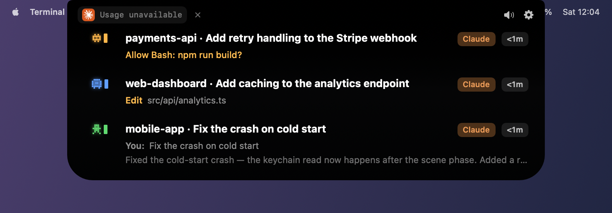
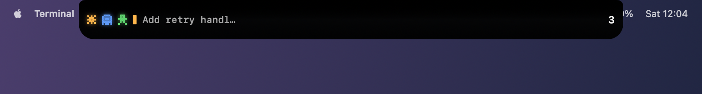
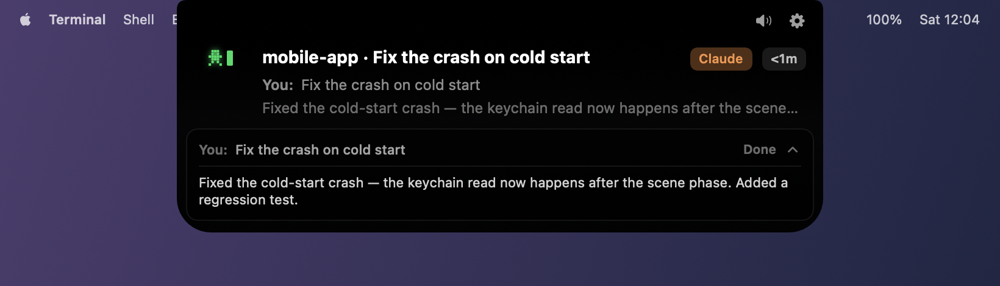
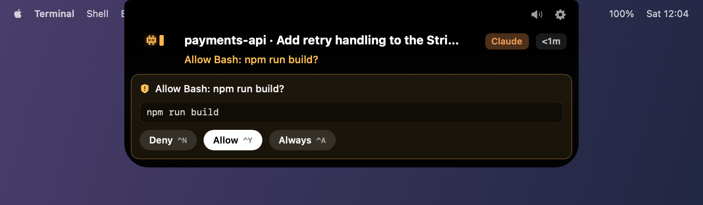
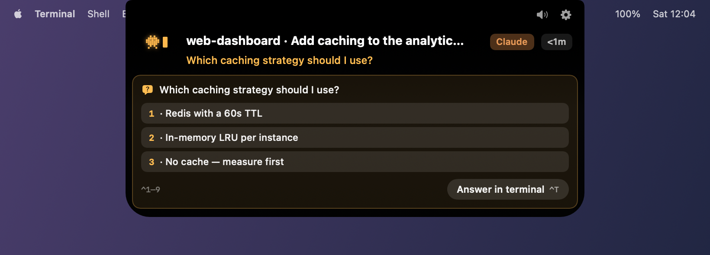

# Token Island

Every running AI coding session as a pixel pet in your Mac's notch — blue while it works,
green when it's done, orange when it's blocked on you. Approve permissions, answer
questions, and jump to the exact terminal without leaving the window you're in.

Native macOS app. Swift and SwiftUI, no Electron. Everything stays on your machine.

<p align="center">
  
</p>

**[Download for macOS](https://github.com/rmm-code/tokenisland/releases/latest/download/TokenIsland.dmg)** ·
signed with a Developer ID, notarised by Apple, and it updates itself.

---

## What you see

Collapsed, it's a strip fused with the notch: one pet per session, what the busiest one is
doing, and a count.



When a session finishes, the card comes to you — the prompt and the answer, without
switching windows.



When an agent needs permission, the command or diff is attached. `⌃Y` allows, `⌃N` denies,
`⌃A` allows that tool from then on.



When it asks a question, the options are numbered — press `⌃1`–`⌃9`.



## What it does

- **A pet per session.** Four sprite species, colour-coded by state. Learn three colours
  once and stop checking terminals to find out whether something needs you.
- **Approve and answer from the notch.** The verdict is returned to the CLI as the hook's
  own reply, so the agent continues without you touching the terminal.
- **Jump to the exact terminal.** Not the app: the specific window, tab and split pane the
  session runs in. Terminal.app, iTerm2, WezTerm and kitty are matched by TTY.
- **Subagent rows.** A fan-out shows every agent, what each is doing right now, and how
  long it's been going.
- **Session switcher.** `⌃G` for a HUD across every running session.
- **Usage limits.** Your session and weekly windows with time-to-reset, read from your own
  account. Per-model caps appear automatically when your plan reports them.
- **8-bit sound cues.** Three synthesised packs, generated at runtime — no audio files.

## Supported agents

Ten CLIs, in three tiers of confidence. Most agent CLIs are Claude Code derivatives that
speak the same hook vocabulary, so they share one implementation.

| Agent | Support |
| --- | --- |
| **Claude Code** | Full — status, approvals, questions, completions, subagents, jump, usage. Verified against real sessions. |
| **Codex** | Monitoring — status, subagents, rate limits, jump. **No approvals** (needs its hooks); sessions are read from the rollout files it already writes. |
| **Qwen · Qoder · Trae · CodeBuddy · Droid · Copilot** | Hook-based, same dialect as Claude Code. Config shape verified on a machine that has each installed; not yet watched through a live session. |
| **Cursor · Gemini CLI** | Monitoring via hooks in their own dialects. Approvals stay in the native CLI. Written against published hooks references; not yet verified against live sessions. |

Anything not listed is not supported — the app only advertises a CLI whose real
configuration has been inspected.

## Requirements

- macOS 14.0 Sonoma or later
- Apple Silicon or Intel (universal binary)
- A notch is **not** required — on other Macs a compact bar appears at the top centre,
  and only while sessions are running

## Installing

1. [Download the DMG](https://github.com/rmm-code/tokenisland/releases/latest/download/TokenIsland.dmg)
2. Drag Token Island to Applications, open it
3. Follow the setup walkthrough — it detects your CLIs and installs their hooks

Two permissions are asked for once each, both explained when they appear:
**Accessibility** (to find and focus the right terminal window) and **Automation** (to drive
Terminal/iTerm). If you use the usage pill, macOS asks once for Keychain access to read the
token Claude Code already stored.

> Hooks apply to **new** sessions. Restart any `claude` you already have running.

Settings → Integrations has an enable switch for each agent. Turning an agent off
removes Token Island's hooks and keeps it disabled after restarting; automatic setup
respects that choice. If a configuration file is invalid, Token Island leaves it
unchanged and reports the error. Correct the file, then choose Retry.

Updates install themselves: the app checks a signed feed, and the menu bar shows
*"Update available"* when there's something newer.

Usage limits refresh every minute while visible. They use the account signed into
Claude Code. Outdated percentages are hidden; the refresh button retries immediately,
and **Connect** explicitly requests Keychain access when needed. Automatic checks
never open an authentication prompt. Saved percentages from previous launches are
discarded, so old account data cannot be mistaken for current limits.

## How it works

```
CLI hook ──POST──> 127.0.0.1:47791/hook/<cli> ──> dialect decode ──> SessionStore ──> notch UI
                                                                     (pure reducer)
```

Setup writes marker-tagged (`#tokenisland-hook`) entries into each CLI's own config,
backing the file up before the first write, and leaving every other entry — including
another tool's — untouched. Uninstall removes only ours.

Permission requests are **parked**: the hook stays open while the request waits in the
notch, and your verdict goes back as its stdout, in the shape that CLI reads. Everything
fails open — if Token Island isn't running, your agents behave exactly as they would
without it.

Codex has no hooks, so those sessions come from a watcher over its rollout files.

## Privacy

No account, no cloud relay, no telemetry, no analytics. Session data never leaves the
machine. Two optional outbound requests: the usage endpoint (read-only, using the token
already in your Keychain) and the update feed. Both can be turned off.

## Building from source

```bash
git clone https://github.com/rmm-code/tokenisland.git
cd tokenisland
bash Scripts/run.sh          # builds the bundle and launches it
```

```bash
swift build                  # Swift 6, strict concurrency
swift test                   # full suite — keep it green
```

Run the **bundle**, never `swift run`: macOS ties Keychain and Accessibility grants to the
code signature, and `swift run` produces a new ad-hoc identity on every build, so every
permission is asked for again, forever. If you have no Apple certificate,
`bash Scripts/create_signing_identity.sh` creates a local one, once.

### Cutting a release

```bash
bash Scripts/release.sh 0.2.2
```

Builds universal, signs with Developer ID and the hardened runtime, notarises, staples,
produces the DMG (download) and the ZIP (what the updater installs), signs the archive for
Sparkle, and writes the appcast. It refuses to produce anything Gatekeeper would reject.
One-time setup is documented at the top of the script.

## Project layout

```
Sources/TokenIslandKit/
  Core/Sessions/     session model, pure reducer, store
  Core/Hooks/        localhost receiver + one decoder per CLI dialect
  Core/Adapters/     CLI descriptors, hook install/repair/uninstall
  Core/Windowing/    the notch overlay: geometry, state machine, hover sentinel
  Core/Jump/         terminal drivers, AX window location, key injection
  Core/Updates/      appcast check; Sparkle is linked by the executable only
  Features/NotchUI/  strip, session cards, reveals, approval and question cards
  Features/Settings/ the settings window
Docs/                architecture, execution plan and status log, design spec
Scripts/             build, run, release, signing identity, demo seeding
```

`Docs/PLAN.md` carries the full status log — what was built, what broke, and why.

## Known limitations

- Six of the ten CLI integrations are wired and unit-tested but have not been watched
  through a live session.
- Codex sessions can't be approved from the notch, and Codex writes no exit record, so a
  finished session lingers longer than a Claude one.
- Four terminals get pane-exact jumping; anything else falls back to activating the app.
  No tmux, no IDE extensions.
- No SSH remote, no licensing, English only.
- Multi-display behaviour is implemented and unit-tested, but untested on real hardware.
- No VoiceOver pass yet.

## Contributing

Issues and pull requests are welcome — see [CONTRIBUTING.md](CONTRIBUTING.md).

## Licence

[MIT](LICENSE).
